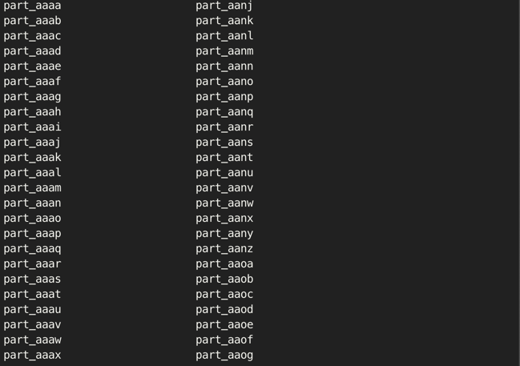

얼마 전 우테코의 코치 **토미**가 인덱스 강의를 해주셨다.
아마 토미가 미리 만들어두신 것으로 추정되는 백만에 가까운 row가 들어있는 대용량의 데이터를 바탕으로 강의가 진행되었다. 원래 수업시간 외에 크루들에게 데이터를 제공할 계획이 없으셨으나, 무수한 백엔드 크루들의 성원에 못이기셨는지 학습 목적으로만 사용하는 것을 조건으로 제공해 주셨다. 

**고로 데이터를 외부에 절대 공유하지 않을 것이다.**

오늘 기록으로 남겨두려는 것은 사실 DB와 직접 관련이 있지는 않고, 어떻게 하면 대용량의 insert 쿼리를 효율적으로 DB에 넣을 수 있는지에 대해서 작성 해보려고 한다.

## mysql_config_editor 자격 증명
[이 블로그의 글(MySQL Root 계정 비밀번호 설정과 확인 방법(mysql_config_editor))](https://zambbon.tistory.com/entry/MySQL-Root-계정-비밀번호-설정과-확인-방법)을 참고하여 `mysql_config_editor`를 사용하여 자격 증명을 설정해둔다. mysql 명령을 실행할 때 비밀번호를 콘솔에 입력하게 되면 보안에 취약하므로 Root 계정을 미리 자격 증명으로 관리하여 콘솔에 노출하지 않도록 한다.
```bash
# 기본적인 명령어는 비밀번호를 노출한다.
mysql -u root -p'password' -h localhost

# 자격 증명을 미리 만들어두어 비밀번호를 노출하지 않고 입력도 간단하다.
mysql --login-path=local
```

---

## sql 파일 분할 명령어

[이 블로그의 글(MySQL 스크립트 실행하는 4가지 방법 소개)](https://zambbon.tistory.com/entry/MySQL-%EC%8A%A4%ED%81%AC%EB%A6%BD%ED%8A%B8-%EC%8B%A4%ED%96%89%ED%95%98%EB%8A%94-4%EA%B0%80%EC%A7%80-%EB%B0%A9%EB%B2%95-%EC%86%8C%EA%B0%9C)을 참고하여 스크립트를 실행.

>pk 포함한 insert 쿼리이니 하나의 파일 전체를 하나의 커넥션에서 실행하는 것보다, 여러 개의 파일로 나눠서 여러 커넥션을 이용해 쿼리를 병렬로 실행하면 좀 더 빠르겠죠? 이렇게 데이터가 많을 때는 텍스트 에디터를 사용하는 것보다, 리눅스 커맨드를 이용해 파일의 특정 라인을 잘라내는 것이 훨씬 빠르고 쉬울 수 있습니다.

라고 토미가 거의 떠먹여 주셔서 말씀해주신 방법으로 시도했다.<br> 
sql은 한 개당 수십만 insert 쿼리로 되어 있었기 때문에 적당히 1000개씩 나눠서 파일로 저장했다.

```bash
split -l 1000 -a 4 'example.sql' part_
```
이 명령어는 'example.sql' 파일을 여러 작은 파일로 분할하는 명령이다.
- `split` : 파일을 분할하는 명령어다.
- `-l 1000` : 각 분할된 파일에 1000줄씩 저장한다. 즉 원본 파일 'example.sql'의 1000 줄마다 새로운 파일이 생성된다.
- `-a 4` : 생성된 파일 이름의 접미사(suffix) 길이를 4자로 설정한다. 기본 접미사는 알파벳 소문자로 시작한다.
- `'example.sql'` : 분할할 원본 파일의 이름이 위치한다.
- `part_` : 생성된 분할 파일의 접두사(prefix)로 사용된다. 각 분할 파일의 접두사는 `part_`로 시작하며, 뒤에 접미사가 붙는다. 

즉 분할된 파일명은 `part_aaaa` 부터 시작하여 `part_zzzz` 까지 생성될 수 있다.
사실 `split -l 1000 'example.sql' part_` 로 실행하여 기본값으로 파일명 2자리가 적용되는지 `part_aa` 부터 `part_zz` 형식으로 분할하던 중에 `split: too many files` 에러가 발생했는데, `-a 4` 옵션을 넣어서 파일명 suffix를 4자리로 늘려서 해결했다.

---

## 병렬 실행 명령어


이렇게 입력한 명령어 대로 한 파일당 1000줄씩 들어있다. 토미가 말씀해주신 대로 pk를 포함한 insert 쿼리이기 때문에, 순서 상관 없이 모두 실행 하기만 하면 된다. 그래서 분할한 파일들을 병렬로 실행할 것이다.

먼저 병렬로 작업을 실행할 때 적절한 병렬 작업 수는 여러 요인에 따라 달라질 수 있지만, CPU 코어 수, 메모리 용량, 디스크 I/O 성능 등이 영향을 미친다. 일반적으로는 서버의 CPU 코어 수를 기준으로 코어 수와 같거나 조금 더 많은 것이 좋다. 예를 들어 8코어 CPU인 경우 8~10개 정도의 병렬 작업을 실행할 수 있다.

파일 읽기/쓰기가 많이 발생하는 작업의 경우, 디스크 I/O 성능도 중요한 요소이다. SSD를 사용하는 경우 더 많은 병렬 작업을 실행할 수 있지만, HDD를 사용하는 경우 디스크 병목 현상을 피하기 위해 병렬 작업 수를 줄이는 것이 좋다.

병렬 작업 수가 너무 많으면 메모리 부족 현상이 발생할 수 있다. 각 작업이 얼마나 많은 메모리를 사용하는지를 고려하여 적절한 병렬 작업 수를 결정해야 한다. 현재 내 환경을 예로 들면, M1 MacBook Pro(16GB RAM, 1TB SSD)이기 때문에 8~12개 정도 병렬 작업을 실행하는 것이 적절할 것이다. 

사전 작업으로 mysql에 database를 생성하고, Entity를 바탕으로 테이블을 생성하여 insert 쿼리를 실행하기 위한 모든 준비를 마쳤다.

터미널에서 명령어로 sql 파일을 mysql 명령으로 실행했는데, 분할한 파일들을 병렬로 실행하기 위한 명령어는 아래와 같다.
`parallel`은 터미널에서 `brew install parallel` 입력하여 설치하였다.

```bash
ls part_* | parallel -j 8 "mysql --login-path=client 'my_database' < {}"
```
- `ls part_*` : 현재 디렉토리에서 `part_`로 시작하는 모든 파일을 나열한다.
- `|` : 파이프라인 연산자로, `ls part_*` 명령어의 출력(파일 목록)을 `parallel` 명령어의 입력으로 전달한다. 마치 java의 `numbers.stream().forEach(number -> parallel.excute(number));` 느낌이라고 이해하면 된다.
- `parallel` : 병렬로 작업을 수행하게 한다. GNU Parallel 명령어로 입력된 작업을 병렬로 실행한다.
- `-j 8` : 동시에 실행할 작업 수를 8개로 설정한다. 즉 지금 하고 있는 작업에서는 8개의 파일을 동시에 MySQL 데이터베이스에 삽입한다.
- `mysql --login-path=client 'my_database' < {}` : 각 파일에 대해 실행할 명령어다. `{}`는 `parallel` 명령어에 의해 파일 이름으로 대체된다. 즉 스트림처럼 `part_*`로 분할된 파일들의 이름이 하나씩 반복적으로 들어가고 명령어가 실행된다.
- `mysql --login-path=client 'my_database` : MySQL 클라이언트를 사용하여 'my_database' 데이터베이스에 접속한다. `--login-path=client`는 미리 설정된 로그인 정보를 사용하여 접속한다.
- `< {}` : `{}`가 `parallel`에 의해 각 파일 이름으로 대체되며, 해당 파일의 내용을 MySQL에 삽입한다.

결국 위 명령어가 실행되면 `part_`로 시작하는 파일들이 MySQL 데이터베이스에 병렬로 삽입된다. 예를 들어 `part_aaaa`, `part_aaab`, `part_aaac`, `part_aaad` ... 총 8개 파일들이 동시에 MySQL에 삽입된다.

---

## 병렬 작업 성능 테스트

추가적으로 동일한 쿼리를 삽입할 때 병렬 작업 개수별 성능 테스트도 해봤다.
`time` 명령어를 사용해서 각 명령어가 실행되는데 걸리는 시간을 측정할 수 있다.
- user: 사용자 모드에서 CPU가 사용된 시간입니다. 이 시간은 CPU가 사용자 프로세스에 의해 작업을 수행하는 데 소요된 시간이다.
- system: 시스템 모드에서 CPU가 사용된 시간입니다. 이 시간은 운영 체제가 시스템 호출을 처리하는 데 소요된 시간이다.
- cpu: CPU 사용률을 나타내며, 전체 시간 동안 CPU가 얼마나 사용되었는지를 백분율로 보여준다.
- total: 전체 경과 시간입니다. 벽 시계 시간으로, 명령어가 시작된 시점부터 끝날 때까지의 총 시간이다.

테스트에 쓰이는 sql 쿼리 데이터의 양은 약 35만 row 가량을 기준으로 한다.

### 단일 커넥션으로 실행
```bash
time mysql --login-path=client coupon < 01-coupon.sql

mysql --login-path=client coupon < 01-coupon.sql  4.77s user 6.11s system 10% cpu 1:45.28 total
```
- 사용자 모드에서 4.77초가 소요,
- 시스템 모드에서 6.11초가 소요,
- 전체 CPU 사용률은 **10%**였고,
- 전체 실행 시간은 1분 45초 28밀리초였다.

### 4개의 커넥션으로 병렬 실행
```bash
time ls part_* | parallel -j 4 "mysql --login-path=client 'my_database' < {}"

ls -G part_*  0.00s user 0.00s system 75% cpu 0.009 total
parallel -j 4 "mysql --login-path=client coupon < {}"  31.58s user 10.41s system 71% cpu 58.573 total
```
**ls 명령어 실행 시간**
- 파일 목록을 나열하는 데 걸린 시간은 거의 무시할 정도로 짧았다 (0.009초).
- CPU 사용률은 75%였지만, 실제 소요 시간은 매우 짧았다.

**parallel 명령어 실행 시간**
- 4개의 병렬 작업으로 mysql 명령어를 실행하는 데 걸린 총 시간은 58.573초였다.
- 유저 모드에서의 CPU 사용 시간은 31.58초, 
- 시스템 모드에서의 CPU 사용 시간은 10.41초였다. 
- 전체 CPU 사용률은 71%로, 병렬 작업이 CPU를 효율적으로 사용했다.

### 8개의 커넥션으로 병렬 실행
```bash
time ls part_* | parallel -j 8 "mysql --login-path=client 'my_database' < {}"

ls -G part_*  0.00s user 0.00s system 77% cpu 0.010 total
parallel -j 8 "mysql --login-path=client coupon < {}"  31.88s user 12.13s system 116% cpu 37.854 total
```
**ls 명령어 실행 시간**
- 파일 목록을 나열하는 데 걸린 시간은 매우 짧았다 (0.010초).
- CPU 사용률은 77%였으며, 유저 모드와 시스템 모드에서의 CPU 시간은 거의 0초에 가깝다.

**parallel 명령어 실행 시간**
- 8개의 병렬 작업으로 mysql 명령어를 실행하는 데 걸린 총 시간은 37.854초였다.
- 유저 모드에서의 CPU 사용 시간은 31.88초, 시스템 모드에서의 CPU 사용 시간은 12.13초였다.
- 전체 CPU 사용률은 116%로, 이는 멀티코어 시스템에서 병렬 작업이 여러 CPU 코어를 사용했다.

> CPU 사용률이 100%를 넘는 것은 시스템이 멀티코어 CPU를 효율적으로 활용하고 있다는 의미이다. 이 수치는 단일 코어 사용률이 아닌, 전체 코어의 총합으로 계산된 값이다.

### 12개의 커넥션으로 병렬 실행
```bash
time ls part_* | parallel -j 12 "mysql --login-path=client coupon < {}"

ls -G part_*  0.00s user 0.00s system 79% cpu 0.010 total
parallel -j 12 "mysql --login-path=client coupon < {}"  29.14s user 9.84s system 135% cpu 28.859 total
```

### 16개의 커넥션으로 병렬 실행
```bash
time ls part_* | parallel -j 16 "mysql --login-path=client coupon < {}"

ls -G part_*  0.00s user 0.00s system 79% cpu 0.010 total
parallel -j 16 "mysql --login-path=client coupon < {}"  29.38s user 9.97s system 152% cpu 25.758 total
```

### 20개의 커넥션으로 병렬 실행
```bash
time ls part_* | parallel -j 20 "mysql --login-path=client coupon < {}"

ls -G part_*  0.00s user 0.00s system 80% cpu 0.011 total
parallel -j 20 "mysql --login-path=client coupon < {}"  29.73s user 10.53s system 154% cpu 26.090 total
```

### 결론
단일 커넥션 실행의 소요 시간은 105.28초였고, 8개 커넥션 실행의 소요 시간은 37.854초로, 단일 커넥션 대비 성능 향상 비율이 약 278%였다. 또한, 8개의 병렬 작업이 4개의 병렬 작업보다 약 35% 더 효율적이라는 점도 확인했다.

추가적으로 12개, 16개, 20개 커넥션으로 병렬 실행한 결과는 다음과 같다
- 12개 커넥션: 28.859초
- 16개 커넥션: 25.758초
- 20개 커넥션: 26.090초

12개와 16개 커넥션 실행 시 8개 커넥션 대비 조금이나마 성능이 계속 향상되었지만, 20개 커넥션에서는 소요 시간이 다시 증가했다. 그 이유는 현재 나의 환경에서 20개 커넥션이 시스템 자원을 초과하여 오히려 성능이 떨어진 것으로 보인다.

이 결과는 병렬로 작업할 수 있는 상황에서 단일 커넥션 대신 병렬 작업을 적절히 활용하면 데이터베이스 작업의 성능이 크게 향상될 수 있음을 보여준다. 그러나 병렬 커넥션 수가 시스템의 최적 성능을 초과하면 오히려 성능이 저하될 수 있다는 점도 중요하다. 따라서, 병렬 처리가 가능한 상황에서는 환경에 맞게 적절한 수의 병렬 작업을 설정하여 성능을 극대화하는 것이 중요하다.
