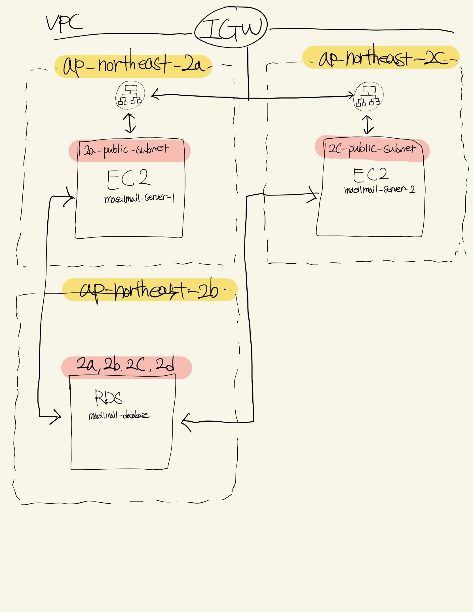
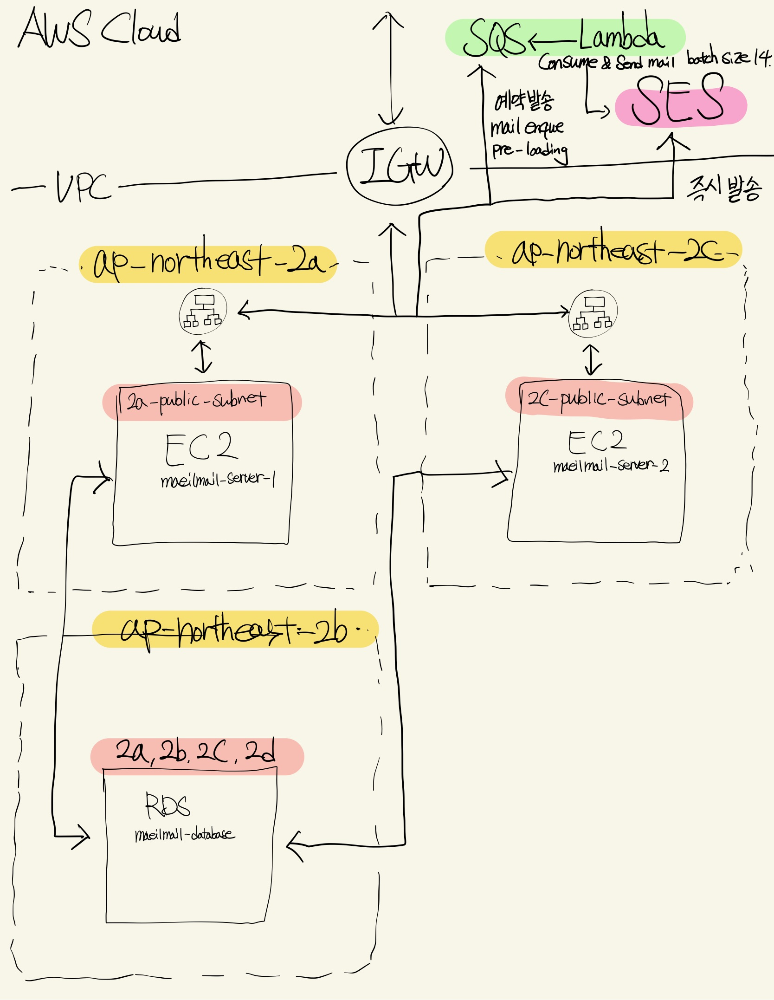

## 요약
>비동기 스레드 풀의 대기 큐 사이즈보다 더 많은 요청이 들어와서 발생한 TaskRejectedExceptoin 에러와, AWS SES 초당 요청 처리 제한 초과로 인해 발생한 SMTPSendFailedExceptioin 에러가 발생하여 해결했습니다. 바로 조치하여 해결할 수도 있었지만, 완벽한 재발 방지를 위해 이틀간 메일을 수동으로 발송하여 운영하고, 원인을 하나씩 제거하며 대응했습니다.

10월 29일 오전 7시 101명의 구독자를 대상으로 발송한 질문지 193건 까지는 면접 질문 메일링 서비스에 문제가 없었다. 하지만 취준생들이 보여서 정보를 공유하는 단체 카톡방에 홍보를 하여 하루 사이에 235명이 신규 구독자가 유입됐다. 에러가 발생한 10월 30일 오전 7시에 340명의 구독자를 대상으로 면접 질문지 메일 428건을 비동기 처리하여 발송하는 작업 중, 245건만 정상 처리되고 에러가 발생하여 183건을 수동으로 처리했다. 애플리케이션 로그를 살펴봤는데 두 가지 에러가 발생한 것을 확인했다.

### 첫 번째 에러 TaskRejectedException

```java
// 에러 메세지
org.springframework.core.task.TaskRejectedException: ExecutorService in active state did not accept task: org.springframework.aop.interceptor.AsyncExecutionInterceptor$$Lambda$1671/0x00007f69a1ae8c70@2009261c

// 원인
Caused by: java.util.concurrent.RejectedExecutionException: Task java.util.concurrent.FutureTask@7695e8af[Not completed, task = org.springframework.aop.interceptor.AsyncExecutionInterceptor$$Lambda$1671/0x00007f69a1ae8c70@2009261c] rejected from org.springframework.scheduling.concurrent.ThreadPoolTaskExecutor$1@1c46c4cc[Running, pool size = 10, active threads = 10, queued tasks = 100, completed tasks = 752]
```
`org.springframework.core.task.TaskRejectedException` 에러는 Spring 애플리케이션에서 비동기 작업을 처리하는 `ThreadPoolTaskExecutor`가 더 이상 새로운 작업을 수용할 수 없을 때 발생한다. 현재 실행중인 `ThreadPoolTaskExecutor` 정보에는 활성중인 스레드 풀 10개, 작업중인 스레드 10개, 큐에 대기중인 작업 100개, 스레드 풀이 생성된 후 완료된 작업 752개가 표시되고 있다.

### 2024년 10월 30일 오전 7시 - 장애 발생 시점의 비동기 스레드 풀 설정
```java
@EnableAsync  
@Configuration  
class AsyncConfig implements AsyncConfigurer {  
  
    /**  
     * corePoolSize보다 적은 스레드가 있거나 maxPoolSize보다 적은 스레드가 실행중이고,     * queueCapacity에 의해 정의된 큐 사이즈가 가득찰 경우 스레드가 생성된다.     */    @Override  
    @Bean("mailExecutor")  
    public Executor getAsyncExecutor() {  
        ThreadPoolTaskExecutor threadPoolTaskExecutor = new ThreadPoolTaskExecutor();  
        threadPoolTaskExecutor.setCorePoolSize(3);  
        threadPoolTaskExecutor.setMaxPoolSize(10);  
        threadPoolTaskExecutor.setQueueCapacity(100);  
        threadPoolTaskExecutor.setThreadNamePrefix("async mail executor-");  
        threadPoolTaskExecutor.initialize();  
  
        return threadPoolTaskExecutor;  
    }  
}
```
1. 기본 스레드 수(core pool size) 3개
2. 최대 수(max pool size) 10개
3. 큐 용량(queue size) 100개

현재 설정으로는 최초 3개의 스레드가 기본으로 활성화 된다. 작업을 처리하는 도중에 작업 큐에 100개가 쌓였고, 활성 스레드가 3개에서 최대 스레드 풀 설정인 10개 까지 점진적으로 늘어나서 총 110개 작업까지 수용할 수 있었다. 그런데 작업이 쌓이는 속도가 처리하는 속도보다 더 빠르기 때문에, `ThreadPoolTaskExecutor`가 작업을 더 수용할 수 없어서 에러가 발생했다.

현재 Tomcat이 있는 EC2 t4g.micro 는 CPU Core가 2개라서 불필요한 컨텍스트 스위칭이 발생할 수 있기 때문에 core pool size와 max pool size를 무작정 높이기 힘든 상황이다.

### 두 번째 에러 SMTPSendFailedException

```java
org.springframework.mail.MailSendException: Failed messages: org.eclipse.angus.mail.smtp.SMTPSendFailedException: 454 Throttling failure: Maximum sending rate exceeded.
```

`org.eclipse.angus.mail.smtp.SMTPSendFailedException: 454 Throttling failure: Maximum sending rate exceeded.`


이 에러는 Amazon SES의 전송 속도 제한을 초과하여 이메일 전송이 거부되어 발생했다. 매일메일이 사용하고 있는 SES는 1초당 평균 14건 이하의 메일을 요청할 수 있는 Sending Rate 제한이 있다. 이 제한을 초과하면 454 Throttling failure 에러가 발생한다.

EC2 두 대를 가동 중이기 때문에 비동기 작업으로 110개 x EC2 두 대로 약 220개 작업까지 수용 가능한 상황이었다. 실제로 10월 29일 메일 전송 건수는 193건을 처리할 때 문제가 발생하지 않았다.

### 1차 대응
결론적으로 두 가지 에러(TaskRejectedException, SMTPSendFailedException)가 발생한 상황에 한 번에 모두 대응을 하게 되면 인과 관계를 제대로 파악하지 못할 수 있다고 판단해서 아래와 같이 조치했다.

```java
public Executor getAsyncExecutor() {
        ThreadPoolTaskExecutor threadPoolTaskExecutor = new ThreadPoolTaskExecutor();
        threadPoolTaskExecutor.setCorePoolSize(3);
        threadPoolTaskExecutor.setThreadNamePrefix("async mail executor-");
        threadPoolTaskExecutor.initialize();
```

1. 스레드 코어 풀 사이즈는 3개로 유지
2. 최대 풀 사이즈 제거(작업이 쌓이는 속도가 처리하는 속도보다 더 빠르기 때문에, `ThreadPoolTaskExecutor`가 작업을 더 수용할 수 없어서 에러가 발생했다는 것을 확인하기 위해 무한 큐를 사용하여 모든 요청을 큐에 넣는다.)
3. 포화 정책 제거(max pool size 설정을 하지 않아서 무한 큐를 사용하기 때문에 큐가 가득 차는 일이 발생하지 않아서 포화 정책이 필요 없다.)

1차 대응으로 위와 같은 설정을 하여`TaskRejectedException` 에러가 발생하지 않는 것을 기대했다. 하지만 SES 초당 최대 전송 건수 14 제한을 넘지 않도록 조치한 것은 아니기 때문에 `SMTPSendFailedException` 에러가 발생할 것으로 예상했다.

### 2차 대응

그 다음날인 31일에는 1차 대응의 결과 예상했던대로 `TaskRejectedException`에러는 발생하지 않았지만, SES 전송 제한인 초당 14건에 걸려서 또 `SMTPSendFailedException` 에러가 발생했다.


`SMTPSendFailedException은` `SendFailedException`을 상속하고, `SendFailedException`은 `MessagingException`을 상속하는 구조다.


오전 7시 정각에 총 545건의 면접 질문 메일을 보내기 작업을 시작해서 3개의 코어 스레드로 07:00:10.326초 까지 236개의 메일을 보내는데 성공했다. 아마도 이 시점에 1초당 23건의 요청을 보냈기 때문에 SES 전송 제한인 초당 평균 14건 제한을 이미 넘었지만, 잠깐 동안 SES 버스트로 처리되다가 결국 지속하지 못하고 스로틀링 에러가 발생한 것으로 예상했다.

스로틀링 에러를 방지하기 위한 가장 쉬운 방법으로는 AWS SES 발신 한도(Sending rate) 증가 요청을 하는 방법이다. 하지만 이 방법을 택하기에는 주어진 전송 할당량(Sending quota)을 다 사용하지도 않았을 뿐더러, 요청이 무조건 받아들여진다는 보장도 없기 때문에 최후의 방법으로 남겨두고자 했다.

그 다음으로 생각한 방법은 다음날 구독자에게 발송할 질문지 메일을 미리 만들어두고 예약 발송하여, 메일 객체 생성과 발송 요청 두 가지 작업을 한 번에 하지 않도록 하는 것이었다.


사용률이 절대적으로 높지는 않지만, EC2 CPU 사용률은 질문지 메일을 발송하는 오전 7시에 사용량이 급증하는 패턴을 띈다. 해당 시간을 피하여 다음날 발송할 질문지 생성 처리를 한다면, 메일 발송 요청 처리와 분리하여 상대적으로 CPU가 일을 하지 않는 시간대에 분산하여 더 효율적으로 EC2를 사용할 수 있다고 생각한다. 하지만 아쉽게도 예약 발송 기능을 SES가 지원하지 않아서 현상태에서는 적용할 수 없었다.

### 예약 발송 기능을 어떻게 구현할 수 있을지?
그렇다면 자체적으로 예약 발송 기능을 어떻게 구현할 수 있을지 생각해봤다. 먼저 매일메일의 인프라 아키텍처는 이렇게 구성돼있다.

ap-northeast-2(서울) 리전은 3개의 AZ로 구성되어 있고, 각각 Public Subnet이 위치한다. 현재 WAS가 구동중인 두 대의 EC2, RDS 모두 Public Subnet에 위치하고 있으며, WAS 앞에 ALB가 위치하여 부하를 분산 하고 있다.

### 예약 발송을 위해 SQS, Lambda 추가한다면?


VPC 외부에 질문지 발송 요청을 비동기적으로 SQS에 적재하고, 트리거를 통해 큐에서 특정 시간(오전 7시)에 메시지(질문지 발송 요청)를 처리하도록 Lambda를 추가했다.

초당 14건 요청 제한을 위한 방법으로 Lambda의 Reverse Concurrency 설정으로 Lambda 함수가 사용할 수 있는 최대 동시실행 인스턴스 수를 제한하여 초당 처리량을 제어하거나, SQS에서 1초당 최대 14건의 메세지를 가져올 수 있도록 설정하는 방법이 있다. 이렇게 SQS와 Lambda를 사용해서 얻는 장점은, 애플리케이션이 더이상 오전 7시에 몰아서 1000개가 넘는 메일 객체를 생성하고, 메일 발송 요청을 처리해야하는 부담을 가지지 않아도 된다는 것이다. 즉, 특정 메일 발송 시간에 집중하여 EC2의 리소스를 사용하는 패턴에서 벗어나, 리소스를 분산하여 사용할 수 있어서 더 안정적인 서비스 운영이 가능하다. 또 SQS와 Lambda는 여러 가용영역에 걸쳐 분산되어 있어, SPOF를 줄일 수 있다. 단점은 현재 인프라 구조에서 SQS, Lambda를 추가로 구성해야 하기 때문에 추가적인 비용이 부담된다는 점이다.

문제 해결의 핵심은 요청 처리율을 제한하는 것이기 때문에, 곧바로 추가적인 인프라를 구성하는 대신에 애플리케이션 내부에서 할 수 있는 방법으로 처리율 제한 알고리즘으로 토큰 버킷 알고리즘, 누출 버킷 알고리즘 등 여러가지 알고리즘이 있었다. 하지만 현재 문제는 사용자가 API를 요청하는 상황에 요청 처리율을 제한하는 것이 아닌, SES 메일 발송 요청을 처리하는 비즈니스 로직의 수행 속도를 제한 속도에 맞게 조절하면 되는 문제이기 때문에 학습 비용을 생각하여 적용하지 않았다. 대신 단순히 3개의 비동기 스레드로 동작하기 때문에 SES 요청 제한인 1초에 14건, 0.5초에 7건을 넘지 않도록 하는걸 목표로 했다. EC2 2대에서 총 6개의 스레드가 요청 1번씩 한 후 Thread.sleep() 메서드로 500ms 쉬게하여 1초에 총 12건 정도의 요청을 보내도록 조절했다.

이렇게 `SMTPSendFailedException 454 Throttling failure: Maximum sending rate exceeded` 에러를 해결할 수 있었지만, 2024-11-08 기준 오전 7시에 1754개의 질문지 메일 발송 스케줄이 시작되어 마치는데 까지 약 3분 26초정도 소요됐고, Thread.sleep()을 사용하여 요청마다 500ms 기다린 것이 전체 요청의 처리 시간을 는다는 단점이 있다. 만약 오전 7시 정각에 구독자 n명이 모두 메일을 받아야 한다면 어떻게 해야할까? 현재 병목현상이 일어나는 부분은 애플리케이션 성능과 상관 없는(현재도 요청 제한보다 훨씬 빠르게 요청을 보낼 수 있기 때문) 외부 서비스인 SES의 Sending Rate 뿐인데, 아마 그런 요구사항이 다른 SMTP 생긴다면 SES 발신 한도 증가 요청을 하고, SES 서비스 개수를 늘려서 처리해야 할 것 같다.

---

## SMTPSendFailedException 예외 처리 문제

그리고 `SMTPSendFailedException` 예외 발생으로 발견한 두 번째 문제는, 실패한 메일이 저장되지 않고 있다는 것이다.

```java
// 현재 MailSender 코드  
@Slf4j  
@Component(value = "emailSender")  
@RequiredArgsConstructor  
public class MailSender {  
  
    private static final String FROM_EMAIL = "매일메일 <maeil-mail-noreply@maeil-mail.site>";  
  
    private final JavaMailSender javaMailSender;  
    private final MailEventRepository mailEventRepository;  
  
    @Async  
    public void sendMail(MailMessage message) {  
  
        try {  
            log.info("메일을 전송합니다. email = {} question = {} type = {}", message.to(), message.subject(), message.type());  
            MimeMessage mimeMessage = convertToMime(message);  
            javaMailSender.send(mimeMessage);
            mailEventRepository.save(MailEvent.success(message.to(), message.type()));  
        } catch (MessagingException e) {  
            mailEventRepository.save(MailEvent.fail(message.to(), message.type()));  
            log.info("메일 전송 실패 = {}", e.getMessage());  
        }  
    }  
  
    private MimeMessage convertToMime(MailMessage message) throws MessagingException {  
        MimeMessage mimeMessage = javaMailSender.createMimeMessage();  
        tryAppendOpenEventTrace(message, mimeMessage);  
        MimeMessageHelper mimeMessageHelper = new MimeMessageHelper(mimeMessage, false, "UTF-8");  
        mimeMessageHelper.setFrom(FROM_EMAIL);  
        mimeMessageHelper.setTo(message.to());  
        mimeMessageHelper.setSubject(message.subject());  
        mimeMessageHelper.setText(message.text(), true);  
        return mimeMessage;  
    }  
  
    private void tryAppendOpenEventTrace(MailMessage message, MimeMessage mimeMessage) throws MessagingException {  
        if ("question".equals(message.type())) {  
            mimeMessage.setHeader("X-SES-CONFIGURATION-SET", "my-first-configuration-set");  
            mimeMessage.setHeader("X-SES-MESSAGE_TAGS", "mail-open");  
        }  
    }  
}
```

현재 `MailSender` 클래스의 `sendMail` 메서드에서 try-catch로 `MessagingException` 예외를 잡아서 처리하고 있는데, `SMTPSendFailedException`은 해당하지 않는 것이 원인이었다.


`JavaMailSender.send()` 메서드는 `MailException`을 던진다. 이 메서드는 내부적으로 `MessagingException`을 잡아서 `MailException`의 하위 클래스인 `MailSendException`으로 래핑한다. 따라서, 실제로는 `MessagingException`이 아닌 `MailException`을 던진다.

현재 코드에서는 `MessagingException`을 캐치하려고 시도하고 있는데, 이는 `JavaMailSender.send()`에서 발생하는 `MailException`을 포괄하지 못한다. 따라서 `MailSendException`이 발생해도 `MessagingException`으로는 잡히지 않고, 비동기 메서드의 예외 처리기인 `SimpleAsyncUncaughtExceptionHandler`로 넘어가게 된다.

```java
// MailException을 catch하여 처리하도록 수정.
@Async  
public void sendMail(MailMessage message) {  
    try {  
        log.info("메일을 전송합니다. email = {} question = {} type = {}", message.to(), message.subject(), message.type());  
        MimeMessage mimeMessage = convertToMime(message);  
        javaMailSender.send(mimeMessage);  
        mailEventRepository.save(MailEvent.success(message.to(), message.type()));  
    } catch (MessagingException | MailException e) {  
        mailEventRepository.save(MailEvent.fail(message.to(), message.type()));  
        log.error("메일 전송 실패: email = {}, type = {}, 오류 = {}", message.to(), message.type(), e.getMessage(), e);  
    } catch (Exception e) {  
        mailEventRepository.save(MailEvent.fail(message.to(), message.type()));  
        log.error("예기치 않은 오류 발생: email = {}, type = {}, 오류 = {}", message.to(), message.type(), e.getMessage(), e);  
    }  
}
```

이를 해결하기 위해 `MessagingException` 대신 `MailException`을 캐치하도록 변경했다. 그 결과로 `MailSendException`을 포함한 모든 메일 전송 관련 예외를 적절히 처리할 수 있게 됐다. 그래서 최소한 실패 메일을 저장할 수 있고, 실패한 메일들을 다시 전송하는 재처리 로직을 수행할 수 있도록 변경하여 장애 상황에서 관리자의 대응이 간편하도록 개선했다.
