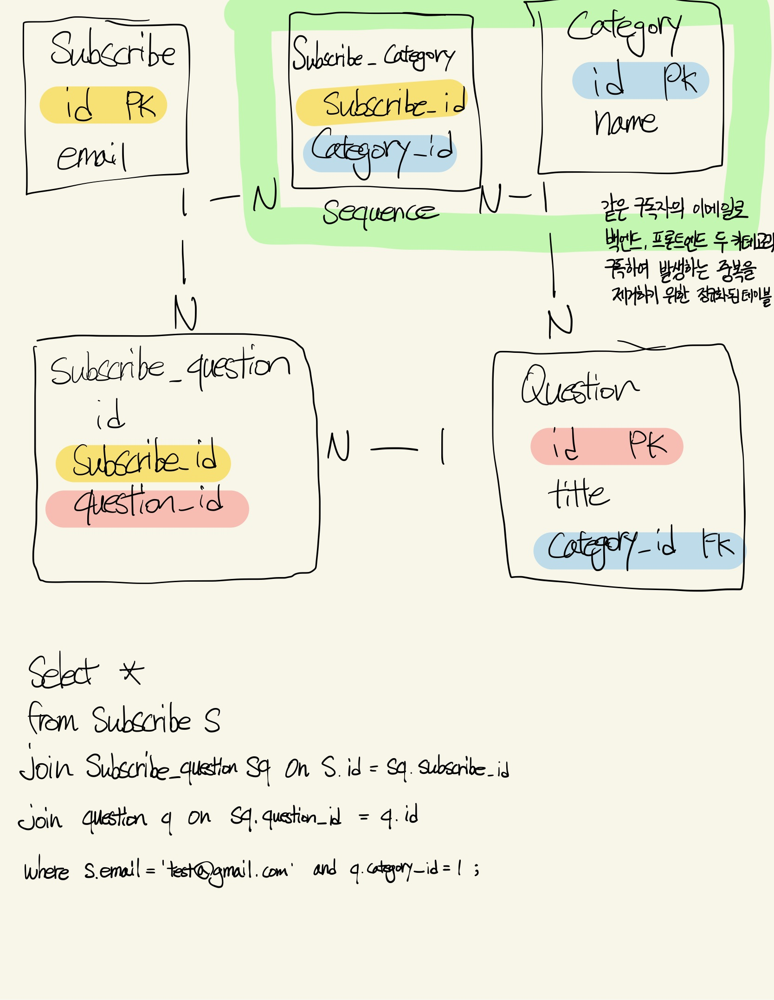

## 요약
>구독자별 받은 질문지 모아보기 기능을 구현하는데 있어서 기존 테이블 관계를 파악하고 추가적인 다대다 테이블을 설계하였습니다. 그 과정에 현재 운영 상황과 스키마 변경 비용을 고려하여 테이블 정규화를 고민했습니다.


2024-11-08 현재 매일메일의 테이블은 구독자, 임시 구독자, 질문, 메일 이벤트, 관리자가 있습니다.
이번 스프린트에 **구독자별로 지금까지 받은 면접 질문을 모아볼 수 있는 기능**을 개발하게 됐습니다.

현재 매일메일의 서비스 정책으로 구독자, 카테고리별 첫 번째 질문부터 순서대로 발송하고 있습니다. 예를 들어 11월 8일 07시 이후에 백엔드 카테고리의 면접 질문을 구독한다면, 하루 뒤인 11월 9일 07시에 백엔드 카테고리의 첫 번째 면접 질문을 메일로 받게 됩니다. 그리고 그 다음 날에는 두 번째 질문을 받게 됩니다.
%% 현재 정책으로는 모든 구독자가 일괄로 오전 7시에 면접 질문을 받지만, 향후 개인이 원하는 시간과 요일에 메일을 받아볼 수 있게 정책이 바뀔 수 있기 때문에 테이블 구조를 점검했습니다. %%

현재 subscribe 테이블에 이 구독자가 구독한 카테고리(백엔드, 프론트엔드)를 가지고 있기 때문에, 하나의 이메일로 두 개의 카테고리를 구독하는 경우 같은 이메일의 행이 2개 생깁니다.

현재 테이블 구조에서는 한 명의 구독자가 받은 질문지를 모두 조회하기 위해서 이렇게 쿼리를 작성해야 합니다.
```sql
select *  
from subscribe s  
join mail_event m on m.email = s.email 
	and (m.type = CONCAT('question-', s.category) or m.type = 'question') 
where s.category = 'backend'
	and s.email = 'test@gmail.com';
```
join절에 `question-`과 `backend`, `frontend`를 `concat` 함수로 합치는 이유는, `2024-10-31`일 이전에는 mail_event 테이블에 type 컬럼의 값으로 질문지임을 나타내기 위해 question을 넣어줬기 때문입니다. 그러다보니 이 메일 이벤트가 백엔드 질문지인지, 프론트엔드 질문지인지 알 수 없는 상황이 발생했고, 질문지를 의미함과 동시에 카테고리를 알 수 있게 해놨습니다. 추가로 11월 첫째 주 부터 주말(토, 일)에는 질문지를 보내지 않는다는 정책이 도입되어, 11월 1일 (금) - 11월 4일 (월) 사이에 질문지를 받지 않았습니다.

쿼리의 결과로 29행이 조회 되었는데, 문제는 위 쿼리로 조회된 행의 수 만으로는 구독자가 받은 질문지를 특정할 수 없는 상황입니다. 이유는 구독 시점이 질문지 추가 시점보다 빠른 사람들에 한해서는, 질문지 리스트를 한 바퀴 돌아서 다시 처음 질문지를 받고 있는 구독자가 있기 때문입니다.

### 정규화 하는 경우

```sql
# category 숫자로 조회 가능한 경우
select *
from subscribe s
join subscribe_question sq on s.id = sq.subscribe_id
join question q on sq.question_id = q.id
where s.email = 'test@gmail.com' 
	and q.category_id = 1;

# category 이름으로 직접 조회해야 하는 경우 category 테이블 조인
select *
from subscribe s
join subscribe_question sq on s.id = sq.subscribe_id
join question q on sq.question_id = q.id
join category c on q.category_id = c.id
where s.email = 'test@gmail.com' 
	and c.name = 'backend';
```

그림의 형광 박스는 기존에 subscribe 테이블의 컬럼으로 category(backend, frontend)를 가지기 때문에 발생하는 동일한 이메일로 2개의 카테고리 중복 행이 생기는 문제를 해결하기 위해 정규화한 테이블 구조입니다. 이렇게 정규화하면 이전에 없던 테이블 간의 연관관계가 생겨서 3번의 join을 거쳐 한 명의 구독자가 특정 카테고리 질문지를 받은 내역을 조회할 수 있습니다.

현재 subscribe 테이블에 이메일 중복 없이 2492명의 구독자, question 테이블에 프론트엔드 39개, 백엔드 31개 모두 합쳐서 70개 질문지가 저장되어 있습니다. 그래서 위 쿼리로 조회하는 경우 subscribe 테이블에서 이메일이 고유하므로 1개, subscribe_question 테이블에서 구독자가 지금까지 받은 질문지 n개, 마지막으로 question 테이블에서 n개 중 카테고리가 같은 질문 m개 행이 선택됩니다.

subscribe의 email, subscribe_question의 subscribe_id, question_id, category의 name 컬럼에 인덱스를 설정하면 3번의 join을 하더라도 크게 성능 문제가 발생하지 않을 것으로 예상합니다. 데이터 중복을 제거할 수 있다는 장점이 있지만, 기존에 운영중인 테이블 구조를 변경해야하는 비용이 크다는 단점이 있습니다.

### 정규화 없이 다대다 중간 테이블 생성하는 경우


```sql
select *
from subscribe s
join subscribe_question sq on s.id = sq.subscribe_id
join question q on sq.question_id = q.id
where s.email = 'test@gamil.com'
and q.category = 'backend';
```

mail_event에서 질문지 발송 이력을 저장하지 않고, subscribe_question 테이블을 새로 만들어서 해결하는 방법이 있습니다. 이 방법을 사용하면, 개인별로 subscribe 테이블에 next_question_sequence를 가지고 있을 필요가 없이 subscribe_question에 저장된 question_id로 구독자가 받은 카테고리별 가장 마지막 질문지를 알아낼 수 있습니다. 기존에 있는 subscribe, question 테이블을 다대다 연관관계로 새로운 중간 테이블 하나를 생성한 것이기 때문에, 스키마 구조 변경으로 다른 테이블이 영향받지 않는 것 또한 장점입니다. 하지만 데이터 중복이 발생하고, 정규화가 되어있지 않아서 스키마 변경이 발생할 경우 유연하게 대처하기 힘들다는 단점이 있습니다.

결론적으로 정규화 없이 다대다 중간 테이블인 subscribe_question을 만들었습니다. 이유는 데이터 중복보다 기존에 mail_event 테이블에 함께 저장되던 질문지 데이터를 분리하는 것이 더 중요한 문제라고 판단했기 때문입니다. 지속적으로 추적해야하는 데이터를 먼저 분리하고, 향후에 추가적으로 테이블 정규화가 필요한 근거가 생기면 그 때 하는 것으로 팀원과 결론을 내렸습니다.
