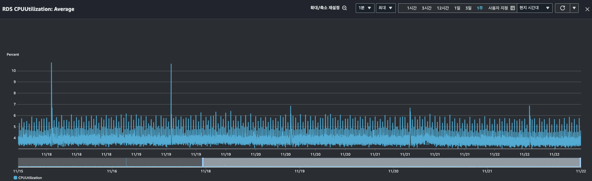

## 요약
> 다양한 캐싱 전략 중에서 로컬 캐시를 선택하여 오전 7시에 RDS에 집중된 조회 작업으로 인한 부하를 줄였습니다. 기존 코드는 카테고리별 질문지(백엔드, 프론트엔드)를 구독자 수 만큼 반복적으로 질문 테이블에서 대량의 데이터를 조회하고 있었는데, 이런 비효율을 해결했습니다.

기존에는 Subscribe 데이터에 들어있는 카테고리로 Question 테이블의 category가 같은 데이터들을 전부 조회해서 가져왔는데, 구독자가 늘어나면서 불필요하게 질문지를 반복해서 조회하는 것을 해결하기 위해 캐시를 도입했습니다.

>기존 질문지 메일을 보내는 sendMail 메서드

```java
@Scheduled(cron = "0 0 7 * * MON-FRI", zone = "Asia/Seoul")  
public void sendMail() {  
    log.info("구독자에게 질문지 발송을 시작합니다.");  
    LocalDateTime now = ZonedDateTime.now(KOREA_ZONE).toLocalDateTime();  
    List<Subscribe> subscribes = subscribeRepository.findAllByCreatedAtBeforeAndDeletedAtIsNull(now);  
    log.info("{}명의 구독자에게 질문지를 발송합니다. 발송 시각 : {}", subscribes.size(), now);  
  
    subscribes.stream()  
            .filter(it -> distributedSupport.isMine(it.getId()))  
            .map(this::choiceQuestion)  
            .filter(Objects::nonNull)  
            .forEach(questionSender::sendMail);  
}
```

캐싱 전략 선택지는 여러가지가 있었습니다.
1. JPA 영속성 컨텍스트 1차 캐시
2. Global Cache(Redis)
3. Local Cache(Caffeine)

### 1. JPA 영속성 컨텍스트 1차 캐시
첫 번째로 영속성 컨텍스트의 1차 캐시에 모든 질문지를 올려두고 재사용하는 방법을 떠올렸지만, 조회 쿼리에 사용하는 조건이 PK가 아닌 category 컬럼이었고, 조회한 결과가 `Question` 엔티티가 아닌 Projection 한 `QeustionSummary` 레코드였기 때문에, 영속성 컨텍스트에 캐싱할 수 없었습니다.
```java
// 카테고리별 질문지 조회 쿼리 메서드
public List<QuestionSummary> queryAllByCategory(String category) {  
    return queryFactory.select(projectionQuestionSummary())  
            .from(question)  
            .where(eqCategory(category))  
            .orderBy(question.id.asc())  
            .fetch();  
}

// QuestionSummary record
public record QuestionSummary(Long id, String title, String content, String customizedTitle, String category) {
	...
}
```

### 2. Global Cache(Redis)
두 번째는 Redis를 Global Cache로 사용하는 방법인데, 두 대의 EC2에서 하나의 원격 캐시 서버를 바라보기 때문에 정합성을 맞출 수 있는 점이 장점입니다. 하지만 추가적인 서버를 한 대 더 두어야 한다는 비용적인 측면과 관리 포인트가 늘어난다는 단점이 있습니다. 만약 넓은 시간대에 걸쳐 조회가 빈번히 일어나는 환경이라면 충분히 합리적인 방법이라고 생각했겠지만, 결정적으로 오전 7시에 RDS에 집중하여 조회하는 문제를 해결하기 위한 방법으로는 맞지않을 뿐더러 과하다 생각하여 제외했습니다.

### 3. Local Cache(Caffeine)
마지막으로 Local Cache 방법을 생각했는데, 먼저 Map을 사용하여 두 개의 EC2 내부에서 각각 백엔드, 프론트엔드 두 카테고리의 질문지 약 80개 정도의 데이터를 repository에서 조회하여 모두 메모리에 올려서 재사용하는 방법을 생각했습니다. 로컬 캐시는 분산된 EC2 환경에서 정합성이 맞지 않을 수 있었지만, 현재 코드에서는 각각 EC2에서 동일한 질문지를 모두 조회 후 사용한다는 점에서 정합성이 문제가 되지 않는다고 생각했습니다. 문제는 구독자별 카테고리에 맞는 질문지를 선택하는 `choiceQuestion` 메서드를 호출하는 대신, 사전에 Map에 캐싱해둔 질문지 데이터를 사용해야 하는데, 스트림의 forEach에서 호출하는 `QuestionSender.sendMail` 메서드가 비동기로 동작하기 때문에 forEach에서 Map에 캐싱한 데이터를 재사용하는 것을 기다리지 않고 캐시를 만료하는 문제가 있었습니다.

> QuestionSender.sendMail 메서드가 비동기라서 캐싱이 바로 만료된다.

```java
@Scheduled(cron = "0 0 7 * * MON-FRI", zone = "Asia/Seoul")  
public void sendMail() {  
	// 질문 캐싱 ...
    log.info("구독자에게 질문지 발송을 시작합니다.");  
    LocalDateTime now = ZonedDateTime.now(KOREA_ZONE).toLocalDateTime();  
    List<Subscribe> subscribes = subscribeRepository.findAllByCreatedAtBeforeAndDeletedAtIsNull(now);  
    log.info("{}명의 구독자에게 질문지를 발송합니다. 발송 시각 : {}", subscribes.size(), now);  
  
    subscribes.stream()  
            .filter(it -> distributedSupport.isMine(it.getId()))  
            .map(this::choiceQuestion)  
            .filter(Objects::nonNull)  
            .forEach(questionSender::sendMail);  
	// 캐싱 만료 ...
}
```
위 문제를 해결하기 위한 방법으로는 Map과 함께 `CompletableFuture.join`을 사용하여 3개의 비동기 스레드가 `subscribes` 수 만큼 `QuestionSender.sendMail` 메서드를 수행하고, 전부 마친 것을 확인한 후 캐싱을 만료하는 방법이 있습니다. `sendMail` 메서드에 `@Transactional` 애너테이션이 선언되어 있지 않아서 트랜잭션이 불필요하게 길어지지는 않지만, 기존에 작성되어 있던 메서드의 시그니처가 변경되어 영향을 받는다는 단점이 있었습니다. 또 의도한대로 모든 비동기 스레드에서 캐싱한 데이터를 사용하고 질문지를 발송한 후 캐시를 만료시킨다면, 캐싱한 데이터를 재사용할 여지가 없이 버려진다는 것 또한 단점이었습니다.

그래서 생각한 다음 방법으로는 SpringFramework에 추상화한 Cache Manager를 사용하는 방법이었습니다. 구현체로는 Ecache와 Caffeine 두 가지를 비교했는데, Caffeine이 더 높은 성능을 나타내는 것으로 파악하여 Caffeine을 선택했습니다.

```java
@Getter  
public enum CacheType {  
  
    QUESTION("question", 1L);  
  
    private final String name;  
    private final Long expiredAfterWrite;  
  
    CacheType(String name, Long expiredAfterWrite) {  
        this.name = name;  
        this.expiredAfterWrite = expiredAfterWrite;  
    }  
}

@Configuration  
@EnableCaching  
class CacheConfig {  
  
    @Bean  
    public CacheManager cacheManager() {  
        List<CaffeineCache> caffeineCaches = Arrays.stream(CacheType.values())  
                .map(this::createCaffeineCache)  
                .toList();  
        SimpleCacheManager simpleCacheManager = new SimpleCacheManager();  
        simpleCacheManager.setCaches(caffeineCaches);  
  
        return simpleCacheManager;  
    }  
  
    private CaffeineCache createCaffeineCache(CacheType cacheType) {  
        return new CaffeineCache(cacheType.getName(), Caffeine.newBuilder()  
                .recordStats()  
                .expireAfterWrite(cacheType.getExpiredAfterWrite(), TimeUnit.HOURS)  
                .build()  
        );  
    }  
}
```
질문지에 대한 캐시 타입을 enum으로 만들고, CacheConfig 설정에서 캐싱 후 만료 시간을 1시간으로 설정했습니다.


질문지가 오전 7시에 발송되면, 해당 질문지에 대한 답변을 확인하는 조회 요청이 많이 들어오기 때문에 카테고리별 질문지 리스트를 조회하거나, 개별 질문지를 조회하는 API에서 캐싱된데이터를 재사용하면 더 효율적일 거라고 생각하여 만료 시간에 여유를 두었습니다.

```java
// QuestionQueryService
@Cacheable(key = "#category", cacheNames = {"question"})  
public List<QuestionSummary> queryAllByCategory(String category) {  
    return queryFactory.select(projectionQuestionSummary())  
            .from(question)  
            .where(question.category.eq(QuestionCategory.from(category)))
            .orderBy(question.id.asc())  
            .fetch();  
}
```
기존 카테고리별 질문지를 조회하는 메서드에 `@Cacheable` 애너테이션을 선언하여 category 키로 요청된 `List<QuestionSummary>` 반환값을 캐싱하도록 했습니다.

```java
@Scheduled(cron = "0 0 7 * * MON-FRI", zone = "Asia/Seoul")  
public void sendMail() {  
    cacheWarmUp();  
  
    log.info("구독자에게 질문지 발송을 시작합니다.");  
    LocalDateTime now = ZonedDateTime.now(KOREA_ZONE).toLocalDateTime();  
    List<Subscribe> subscribes = subscribeRepository.findAllByCreatedAtBeforeAndDeletedAtIsNull(now);  
    log.info("{}명의 구독자에게 질문지를 발송합니다.", subscribes.size());  
  
    subscribes.stream()  
            .filter(it -> distributedSupport.isMine(it.getId()))  
            .map(this::choiceQuestion)  
            .filter(Objects::nonNull)  
            .forEach(questionSender::sendMail);  
}  
  
private void cacheWarmUp() {  
questionQueryService.queryAllByCategory(QuestionCategory.BACKEND.name()); questionQueryService.queryAllByCategory(QuestionCategory.FRONTEND.name()); 
}
```
그리고 질문지 메일을 생성하고 발송하는 메서드인 `sendMail` 호출시, `cacheWarmUp` 메서드를 호출하여 백엔드, 프론트엔드 카테고리의 질문지를 의도적으로 1회 조회하여 캐싱하도록 했습니다. 그러면 이후 스트림에서 `choiceQuestion` 메서드에서 카테고리별 질문지 조회할 때 캐싱된 데이터를 반환하여 RDS에 직접 조회하지 않게 됩니다.

### 결과

```java
@Test  
@DisplayName("오전 7시에 메일을 전송할때 캐시를 사용한다.")  
void sendMailCache() {  
    // 4건  
    for (int i = 0; i < 2; i++) {  
        createQuestion(QuestionCategory.BACKEND);  
        createQuestion(QuestionCategory.FRONTEND);  
    }  
  
    // 4건  
    for (int i = 0; i < 2; i++) {  
        createSubscribe(QuestionCategory.BACKEND);  
        createSubscribe(QuestionCategory.FRONTEND);  
    }  
  
    // sendMail = 3건  
    sendQuestionScheduler.sendMail();  
  
    queryCountTester.assertQueryCount(11);  
}
```

그래서 `sendQuestionScheduler.sendMail` 메서드에서 실제로 발생하는 쿼리는 질문지를 받는 구독자를 조회하는 쿼리 1회, `cacheWarmUp` 메서드에서 발생하는 백엔드, 프론트엔드 카테고리 질문지 조회 2회로 총 3회만 RDS에 조회합니다. 기존에는 3600명의 구독자를 대상으로 질문지 발송시 최소 3600번의 RDS 조회가 발생했는데, 캐싱을 사용하여 같은 데이터에 대한 불필요한 조회를 제거했습니다.


11월 20일 캐시를 적용하여 전과 후의 비교를 보면, RDS의 CPU 사용량이 줄어든 것을 확인할 수 있습니다.
