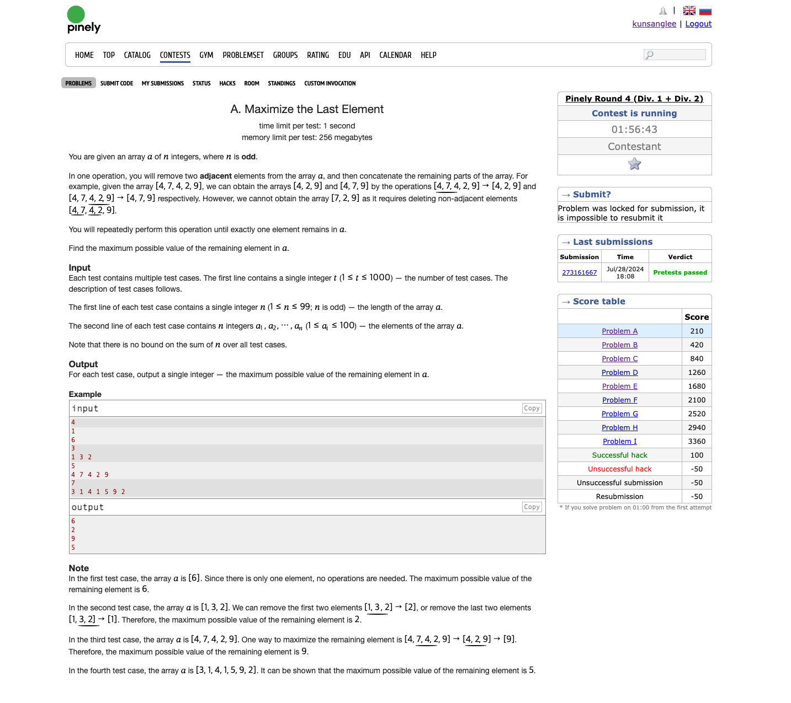

처음으로 참가한 대회 Pinely Round 4 (Div. 1 + Div. 2)

나는 ps를 이제 거의 처음 시작하는 초보라 A번 문제만 풀고 이후 문제는 이해하기 어려워서 진행하지 않았다.

내가 푼 문제는 A. Maximize the Last Element 라는 문제였다.



이 문제는 기본적으로 홀수개의 원소를 가진 배열을 준다.
그리고 원소가 딱 하나만 남을 때 까지 그 배열의 원소 중 연속된 두 원소를 지워나간다.
최종적으로 한 개의 원소만 남게 되는데, 그 원소가 가장 큰 수가 되도록 하는 문제다.

내가 생각한 풀이는 앞에서 부터 3개씩 분리하고 첫 원소와 마지막 원소 중 작은 쪽 원소 두 개를 지우는 방식으로 풀었다.

[4,7,4,2,9] 배열을 예시로 들면 앞에서 3개의 원소는 [4,7,4]이고, 처음 원소가 4, 마지막 원소 또한 4이기 때문에 앞쪽 원소 두개 [4,7]을 지운다.
그리고 남아있는 원소 4는 처음 주어진 배열 [2,9]와 합쳐져서 [4,2,9]가 된다.
다시 [4,2,9] 배열에서 첫 원소인 4와 마지막 원소인 9를 비교하여 중간 원소 2와 작은 쪽 원소, 4를 지우고 9가 남는다.

```java
import java.io.BufferedReader;
import java.io.IOException;
import java.io.InputStreamReader;
import java.util.Arrays;
import java.util.List;
import java.util.stream.Collectors;
 
public class Main {
 
    static BufferedReader br = new BufferedReader(new InputStreamReader(System.in));
 
    public static void main(String[] args) throws IOException {
        int count = parseInput();
        for (int index = 0; index < count; index++) {
            int length = parseInput();
            List<Integer> integers = parseSplitToList(split(readLine(), " "));
            while (integers.size() != 1) {
                // 가장 큰 수 1개가 남도록 2개씩 이어진 원소 제거.
                List<Integer> newOne = integers.subList(0, 3);
                List<Integer> other = integers.subList(3, integers.size());
                if (newOne.get(0) <= newOne.get(2)) {
                    other.addFirst(newOne.get(2));
                    integers = other;
                    continue;
                }
                other.addFirst(newOne.get(0));
                integers = other;
            }
            Integer result = integers.get(0);
            System.out.println(result);
        }
    }
    private static String readLine() throws IOException {
        return br.readLine();
    }
 
    private static int parseInput() throws IOException {
        return Integer.parseInt(readLine());
    }
 
    private static int parseInt(String input) {
        return Integer.parseInt(input);
    }
 
    private static String[] split(String input, String delimiter) {
        return input.split(delimiter);
    }
 
    private static List<String> splitToList(String[] inputs) {
        return Arrays.stream(inputs)
                .collect(Collectors.toList());
    }
 
    private static List<Integer> parseSplitToList(String[] inputs) {
        return Arrays.stream(inputs)
                .map(Integer::parseInt)
                .collect(Collectors.toList());
    }
}
```
